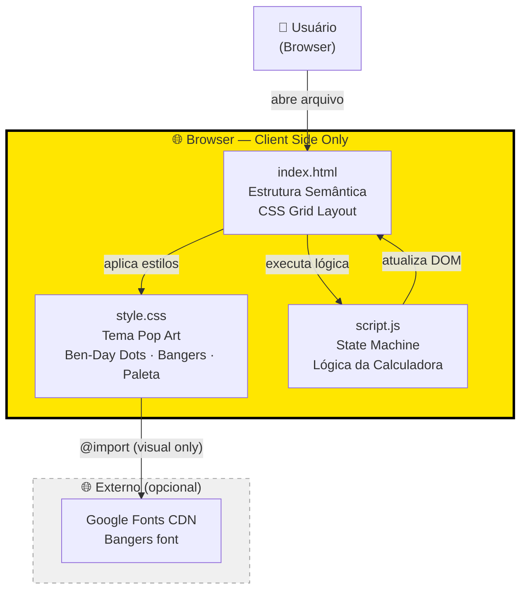
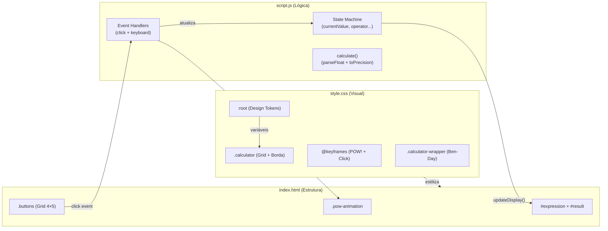
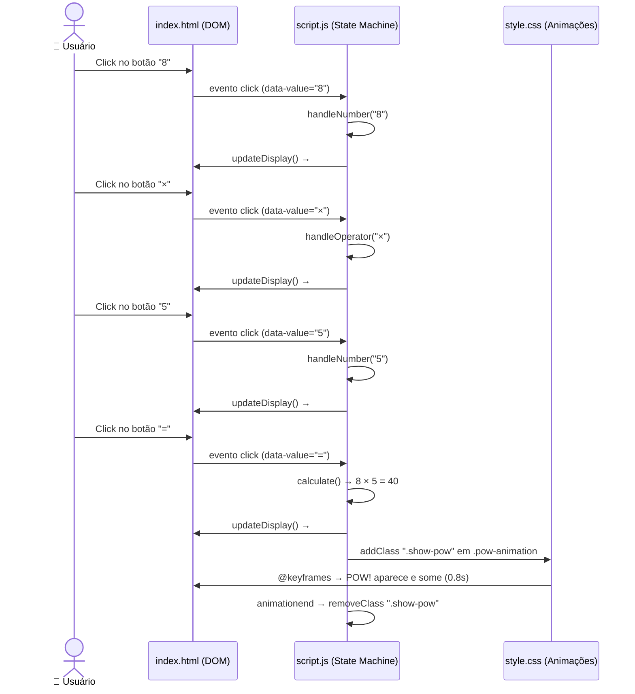
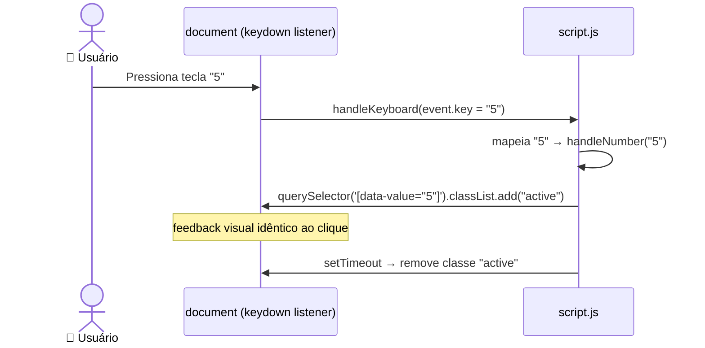
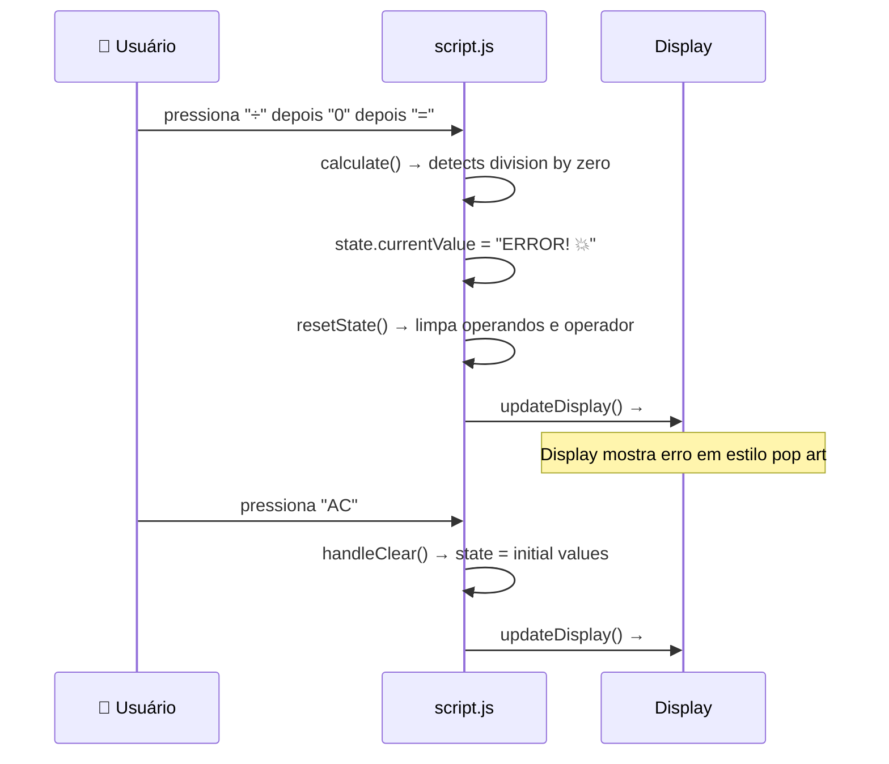

# Calculadora Pop Art — Fullstack Architecture Document

**Versão:** 1.0
**Data:** 2026-05-07
**Autor:** Aria (Architect) — Synkra AIOX
**Status:** Aprovado
**Fontes:** `docs/prd.md`, `docs/brief.md`

> **Nota:** Este projeto é client-side puro — sem backend, sem API, sem banco de dados.
> O template fullstack foi adaptado: seções N/A estão documentadas explicitamente.

---

## Change Log

| Date | Version | Description | Author |
|------|---------|-------------|--------|
| 2026-05-07 | 1.0 | Versão inicial — arquitetura client-side pura | Aria (Architect) |

---

## 1. Introduction

### Starter Template

**N/A — Greenfield project.** Nenhum starter template utilizado. Projeto criado do zero com 3 arquivos estáticos. Decisão consciente de manter zero dependências de build para máxima portabilidade.

---

## 2. High Level Architecture

### Technical Summary

A Calculadora Pop Art é uma **Single Page Application estática** sem nenhuma camada de servidor. Toda a lógica reside no browser — HTML estrutura, CSS estiliza e JavaScript controla o estado. O único recurso externo é a fonte "Bangers" carregada via Google Fonts CDN (impacto apenas visual; fallback definido para uso offline). A arquitetura é intencionalmente minimal: 3 arquivos, zero dependências de runtime, zero build tools, abertura direta via `file://` ou qualquer servidor estático. A separação em 3 arquivos distintos (vs. single-file) maximiza legibilidade e serve como referência educacional para desenvolvedores iniciantes.

### Platform and Infrastructure Choice

**Platform:** Nenhuma — arquivo estático local.

**Distribuição opcional (zero custo):**

| Opção | Comando | URL |
|-------|---------|-----|
| GitHub Pages | `git push` + habilitar Pages | `username.github.io/calculadora-pop-art` |
| Netlify Drop | Arrastar pasta no site | URL gerada automaticamente |
| Local | Duplo-clique em `index.html` | `file:///path/index.html` |

**Key Services:** Nenhum serviço externo obrigatório.
**Deployment Host:** N/A para MVP — local file system.

### Repository Structure

**Structure:** Single directory (não é monorepo — complexidade desnecessária para 3 arquivos)

```
Calculadora/
├── index.html      # Estrutura e markup
├── style.css       # Tema pop art completo
├── script.js       # Lógica da calculadora
└── docs/           # Documentação AIOX
    ├── brief.md
    ├── prd.md
    └── architecture.md
```

**Monorepo Tool:** N/A
**Package Organization:** N/A — sem `package.json`, sem `node_modules`

### High Level Architecture Diagram



### Architectural Patterns

- **Static Site (Zero-Server):** Arquivo HTML abre diretamente no browser sem servidor — _Rationale:_ máxima portabilidade, zero infraestrutura, adequado para ferramentas utilitárias standalone
- **State Machine (JS):** Estado da calculadora gerenciado por variáveis e funções puras — _Rationale:_ previsibilidade, testabilidade manual e clareza para desenvolvedores iniciantes
- **CSS Custom Properties (Design Tokens):** Paleta de cores e métricas em variáveis CSS em `:root` — _Rationale:_ manutenibilidade e preparação para tema Phase 2 sem refatoração
- **Progressive Enhancement:** HTML funcional mesmo sem CSS, CSS funcional mesmo sem animações — _Rationale:_ robustez e acessibilidade básica
- **Event Delegation Pattern:** Event listeners centralizados no container de botões — _Rationale:_ performance e simplicidade vs. listener por botão

---

## 3. Tech Stack

### Technology Stack Table

| Category | Technology | Version | Purpose | Rationale |
|----------|-----------|---------|---------|-----------|
| Markup | HTML5 | Living Standard | Estrutura semântica da calculadora | Padrão web universal, sem compilação |
| Styling | CSS3 | Living Standard | Tema pop art, layout, animações | Grid, Custom Props, Keyframes nativos |
| Language | JavaScript | ES6+ (2015+) | State machine, event handling | Suportado em todos os browsers-alvo |
| Typography | Bangers (Google Fonts) | Latest | Lettering estilo comic book | Única fonte que captura o estilo pop art |
| Layout | CSS Grid | Nativo | Grid 4×5 de botões | Suporte universal, sem framework |
| Animations | CSS Keyframes | Nativo | Animação POW!, efeito de clique | Zero JS overhead para animações |
| Design Tokens | CSS Custom Properties | Nativo | Paleta de cores, espaçamentos | Facilita manutenção e futuros temas |
| Build Tool | N/A | — | — | Projeto não requer build step |
| Package Manager | N/A | — | — | Zero dependências de runtime |
| Testing | Manual | — | Verificação de ACs e edge cases | Escopo pequeno não justifica framework |
| Version Control | Git (opcional) | Latest | Histórico de mudanças | Recomendado para distribuição |
| Hosting | GitHub Pages / Netlify | — | Distribuição opcional | Gratuito, sem configuração de servidor |
| Browser Support | Chrome 90+, Firefox 88+, Safari 14+, Edge 90+ | — | Compatibilidade | CSS Grid e Custom Properties suportados |

---

## 4. Data Models

### Calculator State

**Purpose:** Representação do estado interno da calculadora em memória (JavaScript runtime). Não há persistência — estado é efêmero e resetado ao recarregar a página.

**Key Attributes:**
- `currentValue`: string — número em construção no display
- `previousValue`: string — operando armazenado antes do operador
- `operator`: string | null — operador pendente (`+`, `-`, `×`, `÷`)
- `shouldResetDisplay`: boolean — flag para resetar display no próximo dígito
- `lastOperator`: string | null — último operador (para repetição do `=`)
- `lastOperand`: string | null — último operando (para repetição do `=`)

```javascript
// Estado inicial — sem TypeScript (projeto vanilla JS)
const state = {
  currentValue: '0',
  previousValue: '',
  operator: null,
  shouldResetDisplay: false,
  lastOperator: null,
  lastOperand: null
};
```

**Relationships:** N/A — modelo único, sem relações entre entidades.

---

## 5. Components

> **Nota:** "Componentes" neste contexto são os 3 arquivos e suas responsabilidades internas — não há framework de componentes.

### `index.html` — Estrutura e Markup

**Responsibility:** Define a estrutura semântica completa da calculadora. É o ponto de entrada da aplicação. Liga os outros dois arquivos via `<link>` e `<script>`.

**Key Interfaces:**
- `#expression` — elemento que exibe a expressão atual
- `#result` — elemento que exibe o resultado
- `.buttons` — container do grid de botões
- `data-value` — atributo em cada botão para identificar seu valor no JS

**Dependencies:** `style.css` (estilos), `script.js` (lógica)

**Technology Stack:** HTML5 semântico · ARIA labels · CSS Grid via classes

---

### `style.css` — Tema Visual Pop Art

**Responsibility:** Toda a identidade visual do projeto. Define variáveis CSS, layout Grid, tema pop art (Ben-Day dots, bordas, sombras, tipografia), animações e estados interativos.

**Key Interfaces:**
- `:root` — CSS Custom Properties (design tokens da paleta)
- `.calculator-wrapper` — container externo com Ben-Day dots
- `.calculator` — caixa principal com borda grossa e sombra
- `.display` — área de display estilo balão de quadrinho
- `.btn-*` — classes de variantes de botões (`number`, `operator`, `equals`, `clear`)
- `.pow-animation` — elemento e animação do "POW!"
- `:active` — efeito de clique físico nos botões

**Dependencies:** Google Fonts CDN (`@import` — apenas visual)

**Technology Stack:** CSS3 · Custom Properties · Grid · Keyframes · `radial-gradient`

---

### `script.js` — Lógica da Calculadora

**Responsibility:** State machine completa da calculadora. Gerencia estado, processa inputs (click e teclado), realiza cálculos, atualiza o DOM e controla animações.

**Key Interfaces:**
- `handleNumber(digit)` — processa dígito pressionado
- `handleOperator(op)` — processa operador pressionado
- `calculate()` — executa operação pendente
- `handleClear()` — reseta estado completo
- `handlePlusMinus()` — inverte sinal
- `handlePercent()` — calcula percentual
- `handleDecimal()` — adiciona ponto decimal
- `updateDisplay()` — sincroniza DOM com estado
- `triggerPowAnimation()` — dispara animação POW!
- `handleKeyboard(e)` — mapeia teclas para funções

**Dependencies:** DOM (`index.html`) — manipulação via `getElementById` e `querySelector`

**Technology Stack:** JavaScript ES6+ · Event Listeners · DOM API · `parseFloat` · `toPrecision`

---

### Component Diagram



---

## 6. External APIs

**N/A** — Nenhuma integração com APIs externas no MVP.

**Exceção visual:** Google Fonts CDN (`https://fonts.googleapis.com`) para a fonte Bangers.
- **Autenticação:** Nenhuma
- **Rate Limits:** N/A (CDN público)
- **Fallback:** `font-family: 'Bangers', Impact, fantasy` — calculadora funciona sem a fonte

---

## 7. Core Workflows

### Workflow Principal — Realizar um Cálculo



### Workflow — Suporte a Teclado



---

## 8. Database Schema

**N/A** — Projeto sem persistência de dados. Todo o estado é mantido em memória JavaScript durante a sessão.

**Phase 2 (fora do escopo MVP):** `localStorage` para histórico de cálculos.

---

## 9. Frontend Architecture

> Este projeto é 100% frontend — não existe camada backend.

### Component Architecture

**Organização de arquivos:**

```
Calculadora/
├── index.html          # Único arquivo HTML — sem rotas, sem templates
├── style.css           # Único arquivo CSS — BEM-like naming via classes semânticas
└── script.js           # Único arquivo JS — IIFE ou módulo simples
```

**Padrão de nomenclatura CSS (BEM adaptado):**
```css
/* Bloco */
.calculator { }
.display { }

/* Elemento */
.btn-number { }
.btn-operator { }
.btn-equals { }
.btn-clear { }

/* Estado */
.btn-number:active { }        /* clique */
.pow-animation.show-pow { }   /* animação ativa */
```

### State Management Architecture

```javascript
// Estado global único — sem biblioteca, sem padrão Flux
// Justificativa: escopo suficientemente pequeno para estado simples

const state = {
  currentValue: '0',       // Número sendo digitado
  previousValue: '',        // Operando anterior ao operador
  operator: null,           // Operador pendente: '+' | '-' | '×' | '÷' | null
  shouldResetDisplay: false, // Flag: próximo dígito reseta display
  lastOperator: null,       // Para repetição do = consecutivo
  lastOperand: null         // Para repetição do = consecutivo
};

// Padrão de atualização: funções puras modificam estado → updateDisplay() sincroniza DOM
function updateDisplay() {
  document.getElementById('expression').textContent = /* expressão */;
  document.getElementById('result').textContent = state.currentValue;
}
```

**State Management Patterns:**
- Estado centralizado em objeto único (sem módulos separados — escopo justifica)
- Funções de handler são a única forma de modificar estado
- `updateDisplay()` é chamada ao final de cada handler (single source of truth para o DOM)
- Nenhuma mutação direta do DOM fora de `updateDisplay()` e `triggerPowAnimation()`

### Routing Architecture

**N/A** — Single page sem rotas. Toda a interface está em uma única view sem navegação.

### Frontend Services Layer

**N/A** — Sem chamadas a APIs. Toda a lógica é local e síncrona.

**Única "integração" externa:**
```css
/* style.css — única dependência externa */
@import url('https://fonts.googleapis.com/css2?family=Bangers&display=swap');
```

---

## 10. Backend Architecture

**N/A — Projeto sem backend.**

Não há servidor, não há API, não há banco de dados, não há autenticação, não há sessões.

---

## 11. Unified Project Structure

```plaintext
Calculadora/
│
├── index.html                  # Entry point — estrutura semântica HTML5
│   ├── <head>                  # Meta, charset, viewport, links (CSS + Fonts)
│   ├── .calculator-wrapper     # Container externo (Ben-Day dots background)
│   │   ├── h1.title            # "POW! CALC!" — título estilo quadrinho
│   │   └── .calculator         # Caixa principal da calculadora
│   │       ├── .display        # Display duplo (expressão + resultado)
│   │       │   ├── #expression # Linha superior — expressão atual
│   │       │   └── #result     # Linha inferior — resultado
│   │       ├── .buttons        # CSS Grid 4×5 de botões
│   │       │   ├── [AC]        # .btn-clear — data-value="AC"
│   │       │   ├── [+/-]       # .btn-special — data-value="+/-"
│   │       │   ├── [%]         # .btn-special — data-value="%"
│   │       │   ├── [÷]         # .btn-operator — data-value="÷"
│   │       │   ├── [7][8][9]   # .btn-number — data-value="7/8/9"
│   │       │   ├── [×]         # .btn-operator — data-value="×"
│   │       │   ├── [4][5][6]   # .btn-number — data-value="4/5/6"
│   │       │   ├── [-]         # .btn-operator — data-value="-"
│   │       │   ├── [1][2][3]   # .btn-number — data-value="1/2/3"
│   │       │   ├── [+]         # .btn-operator — data-value="+"
│   │       │   ├── [0]         # .btn-number span-2 — data-value="0"
│   │       │   ├── [.]         # .btn-number — data-value="."
│   │       │   └── [=]         # .btn-equals — data-value="="
│   │       └── .pow-animation  # Elemento da animação POW! (oculto por padrão)
│   └── <script src="script.js" defer>
│
├── style.css                   # Tema visual pop art completo
│   ├── @import Google Fonts    # Bangers font
│   ├── :root { }               # CSS Custom Properties (design tokens)
│   ├── * { box-sizing }        # Reset mínimo
│   ├── body { }                # Ben-Day dots via radial-gradient
│   ├── .calculator-wrapper { } # Layout centralizado
│   ├── h1.title { }            # Título "POW! CALC!"
│   ├── .calculator { }         # Caixa principal — borda + sombra
│   ├── .display { }            # Balão de quadrinho
│   ├── #expression { }         # Linha de expressão
│   ├── #result { }             # Linha de resultado
│   ├── .buttons { }            # CSS Grid 4 colunas
│   ├── .btn-* { }              # Variantes de botões
│   ├── .btn-*:hover { }        # Estado hover
│   ├── .btn-*:active { }       # Estado de clique (transform)
│   ├── @keyframes pow { }      # Animação POW!
│   └── .pow-animation { }      # Elemento da animação
│
├── script.js                   # State machine da calculadora
│   ├── // State              
│   │   └── const state = { }  # Estado global único
│   ├── // DOM References
│   │   └── const els = { }    # Referências cached dos elementos
│   ├── // Core Functions
│   │   ├── handleNumber()
│   │   ├── handleOperator()
│   │   ├── calculate()
│   │   ├── handleClear()
│   │   ├── handlePlusMinus()
│   │   ├── handlePercent()
│   │   ├── handleDecimal()
│   │   └── updateDisplay()
│   ├── // Animation
│   │   └── triggerPowAnimation()
│   ├── // Event Listeners
│   │   ├── buttons.addEventListener('click')    # Delegação de eventos
│   │   └── document.addEventListener('keydown') # Suporte a teclado
│   └── // Keyboard Map
│       └── const keyMap = { }  # Mapeamento tecla → handler
│
└── docs/
    ├── brief.md                # Project Brief (Atlas/Analyst)
    ├── prd.md                  # Product Requirements (Morgan/PM)
    └── architecture.md         # Este documento (Aria/Architect)
```

---

## 12. Development Workflow

### Local Development Setup

**Prerequisites:**
```bash
# Nenhuma instalação necessária para desenvolvimento básico
# Apenas um browser moderno (Chrome 90+, Firefox 88+, Safari 14+)

# Opcional: servidor local para evitar restrições de file://
# Opção 1: Python (geralmente já instalado)
python -m http.server 8080

# Opção 2: Node.js http-server
npx http-server .

# Opção 3: VS Code Live Server extension
# Instalar extensão "Live Server" e clicar em "Go Live"
```

**Initial Setup:**
```bash
# Criar os 3 arquivos (ou deixar @dev criar)
touch index.html style.css script.js

# Abrir no browser
# Windows: start index.html
# Mac: open index.html
# Linux: xdg-open index.html
```

**Development Commands:**
```bash
# Sem build step — editar e recarregar o browser (F5)
# Para debug: F12 → Console no browser

# Verificar lint (opcional, sem configuração formal):
# VS Code com extensões: ESLint, Stylelint, HTMLHint

# Verificar acessibilidade (opcional):
# Extensão axe DevTools no browser
```

### Environment Configuration

**N/A** — Sem variáveis de ambiente. Sem `.env` files. Sem secrets.

A única "configuração" é o URL da fonte no CSS:
```css
@import url('https://fonts.googleapis.com/css2?family=Bangers&display=swap');
```

---

## 13. Deployment Architecture

### Deployment Strategy

**MVP — Arquivo Local:**
- Distribuir o arquivo `index.html` + `style.css` + `script.js` em uma pasta zipada
- Usuário descompacta e abre `index.html` com duplo-clique

**Distribuição Web (opcional):**

| Ambiente | Frontend URL | Método | Custo |
|----------|-------------|--------|-------|
| Development | `file:///path/index.html` | Arquivo local | Gratuito |
| GitHub Pages | `username.github.io/repo` | `git push` + Pages config | Gratuito |
| Netlify Drop | URL gerada | Arrastar pasta | Gratuito |
| Production | URL customizada | Domínio próprio + Netlify/Vercel | ~$10/ano (domínio) |

**CI/CD Pipeline:** N/A para MVP — sem build step, sem testes automatizados.

---

## 14. Security and Performance

### Security Requirements

**Frontend Security:**
- **XSS Prevention:** Sem `innerHTML` com dados externos — todo conteúdo do display via `textContent`
- **Input Validation:** Apenas dígitos e operadores válidos processados — inputs inválidos ignorados silenciosamente
- **Data Exposure:** Zero — nenhum dado transmitido, nenhum cookie, nenhuma API call
- **CSP Headers:** N/A para arquivo local; recomendado se hospedar em servidor

**Sem autenticação, sem sessões, sem backend** — superfície de ataque mínima.

### Performance Optimization

**Frontend Performance:**
- **Bundle Size Target:** < 10KB total (HTML + CSS + JS combinados, excluindo fonte)
- **Loading Strategy:** CSS no `<head>`, JS com `defer` — zero render-blocking
- **Font Loading:** `display=swap` na URL do Google Fonts — texto visível imediatamente com fallback
- **Caching:** Automático pelo browser — arquivos estáticos cacheados localmente
- **Animations:** CSS puro — zero JavaScript overhead para efeitos visuais; `will-change` apenas no `.pow-animation`
- **DOM Updates:** Minimal — apenas `#expression` e `#result` atualizados por interação

---

## 15. Testing Strategy

### Testing Pyramid

```
        Manual E2E
       /          \
   Manual Funcional
  /                \
Edge Cases (Manual)
```

> **Justificativa:** Escopo de 3 arquivos, sem CI/CD formal — framework de testes automatizados adicionaria complexidade desproporcional. Critérios de aceitação do PRD servem como checklist de teste manual.

### Test Organization

**Checklist de Testes Manuais (por Story):**

```
Story 1.1 — Estrutura HTML:
  □ Abre sem erros no console
  □ 20 botões presentes no DOM
  □ Display com 2 linhas visíveis
  □ Fonte Bangers carregada

Story 1.2 — CSS Pop Art:
  □ Ben-Day dots visíveis no fundo
  □ Botões numéricos amarelos #FFE600
  □ Botões operadores vermelhos #FF0044
  □ Botão = azul #0044FF
  □ Bordas pretas 3-4px em todos os elementos
  □ Box-shadow offset visível
  □ Responsivo em 375px viewport

Story 1.3 — Lógica JS:
  □ 5 + 3 = 8
  □ 10 / 2 = 5
  □ 7 × 8 = 56
  □ 0.1 + 0.2 = 0.3 (não 0.30000000004)
  □ 5 / 0 = "ERROR! 💥"
  □ AC reseta tudo
  □ +/- inverte sinal
  □ % funciona (50% = 0.5)
  □ = repetido repete última operação
  □ Operadores consecutivos: substitui sem calcular

Story 1.4 — Interações:
  □ Clique tem efeito de afundamento
  □ Hover tem feedback visual
  □ = dispara animação POW!
  □ Teclas 0-9 funcionam
  □ Teclas +, -, *, / funcionam
  □ Enter/= calcula
  □ Escape limpa
  □ POW! não bloqueia input rápido consecutivo
```

---

## 16. Coding Standards

### Critical Rules

- **`textContent` obrigatório:** Nunca usar `innerHTML` para atualizar o display — previne XSS acidental e garante que números não sejam interpretados como HTML
- **Estado centralizado:** Nunca modificar o DOM sem passar pela função `updateDisplay()` — single source of truth
- **`parseFloat + toPrecision(12)`:** Sempre normalizar resultados de ponto flutuante: `parseFloat(result.toPrecision(12))` — previne `0.1 + 0.2 = 0.30000000004`
- **Event delegation:** Usar um único listener no container `.buttons` em vez de listeners por botão — performance e manutenibilidade
- **CSS Custom Properties obrigatórias:** Todas as cores devem referenciar variáveis de `:root` — nunca hardcoded nos seletores
- **`defer` no script:** O `<script>` deve ter atributo `defer` — garante que o DOM está pronto antes de qualquer querySelector
- **`aria-label` em todos os botões:** Obrigatório para acessibilidade mínima — especialmente em botões com símbolos (÷, ×, ±)

### Naming Conventions

| Element | Convention | Example |
|---------|-----------|---------|
| CSS Classes | kebab-case semântico | `.btn-operator`, `.pow-animation` |
| CSS Variables | `--kebab-case` | `--yellow`, `--shadow-offset` |
| JS Functions | camelCase, verbo + substantivo | `handleNumber()`, `updateDisplay()` |
| JS State vars | camelCase | `currentValue`, `shouldResetDisplay` |
| HTML IDs | camelCase | `#expression`, `#result` |
| HTML data attrs | `data-value` | `data-value="+"` |

---

## 17. Error Handling Strategy

### Error Flow



### Error Types & Handling

| Erro | Detecção | Resposta | Recuperação |
|------|----------|----------|-------------|
| Divisão por zero | `denominator === 0` em `calculate()` | Display `"ERROR! 💥"`, reset state | Usuário pressiona AC |
| Múltiplos pontos decimais | Check `currentValue.includes('.')` em `handleDecimal()` | Input ignorado silenciosamente | N/A — sem feedback (comportamento padrão de calculadoras) |
| Operadores consecutivos | `operator !== null` em `handleOperator()` | Substitui operador atual | N/A — comportamento correto |
| Overflow de dígitos | `currentValue.length >= 12` em `handleNumber()` | Input ignorado silenciosamente | N/A — limite atingido |
| Resultado muito longo | `result.toString().length > 12` | Notação científica via `toPrecision` | N/A — exibição automática |

### Frontend Error Handling (JavaScript)

```javascript
function calculate() {
  const prev = parseFloat(state.previousValue);
  const curr = parseFloat(state.currentValue);

  // Guard: divisão por zero
  if (state.operator === '÷' && curr === 0) {
    state.currentValue = 'ERROR! 💥';
    state.operator = null;
    state.previousValue = '';
    state.shouldResetDisplay = true;
    updateDisplay();
    return;
  }

  let result;
  switch (state.operator) {
    case '+': result = prev + curr; break;
    case '-': result = prev - curr; break;
    case '×': result = prev * curr; break;
    case '÷': result = prev / curr; break;
    default: return;
  }

  // Normalização: previne floating point artifacts
  state.currentValue = parseFloat(result.toPrecision(12)).toString();
  state.operator = null;
  state.previousValue = '';
  state.shouldResetDisplay = true;
  updateDisplay();
}
```

---

## 18. Monitoring and Observability

**N/A para MVP** — Projeto local sem infraestrutura de monitoramento.

**Debug local:**
```javascript
// Ativar debug mode temporariamente durante desenvolvimento:
// Adicionar ao início de script.js:
const DEBUG = false; // toggle para true durante dev

function logState() {
  if (DEBUG) console.table(state);
}
// Chamar logState() ao final de cada handler durante debug
```

**Browser DevTools:**
- `F12 → Console` — erros JS em tempo real
- `F12 → Elements` — inspeção do DOM e classes ativas
- `F12 → Network` — verificar carregamento da fonte Bangers

---

## Checklist Results — Architect Review

| # | Critério | Status | Observação |
|---|----------|--------|------------|
| 1 | Arquitetura adequada ao escopo | ✅ | Client-side puro — sem over-engineering |
| 2 | Tech stack definido e justificado | ✅ | HTML5 + CSS3 + JS ES6 vanilla |
| 3 | Separação de responsabilidades | ✅ | 3 arquivos com responsabilidades distintas |
| 4 | Estado gerenciado de forma previsível | ✅ | State machine centralizada |
| 5 | Performance considerada | ✅ | CSS animations, defer, textContent |
| 6 | Segurança básica | ✅ | textContent, zero APIs externas |
| 7 | Acessibilidade contemplada | ✅ | ARIA labels, keyboard support |
| 8 | Error handling definido | ✅ | Divisão por zero, edge cases mapeados |
| 9 | Coding standards definidos | ✅ | 7 regras críticas documentadas |
| 10 | Estrutura de arquivos clara | ✅ | Annotated project tree |
| 11 | Workflow de desenvolvimento | ✅ | Sem build step, servidor opcional |
| 12 | Rastreabilidade PRD → Arquitetura | ✅ | Todos os FRs/NFRs cobertos |

**Resultado:** ✅ Arquitetura aprovada — 12/12 critérios atendidos

---

*Documento gerado por Aria (Architect) · Synkra AIOX · 2026-05-07*
